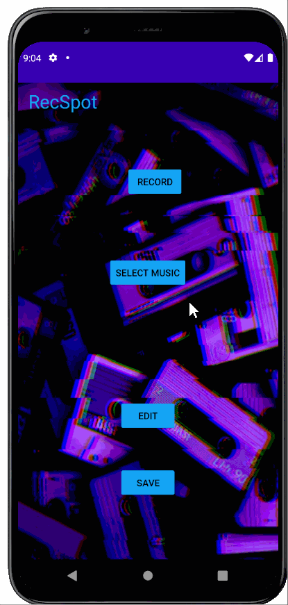
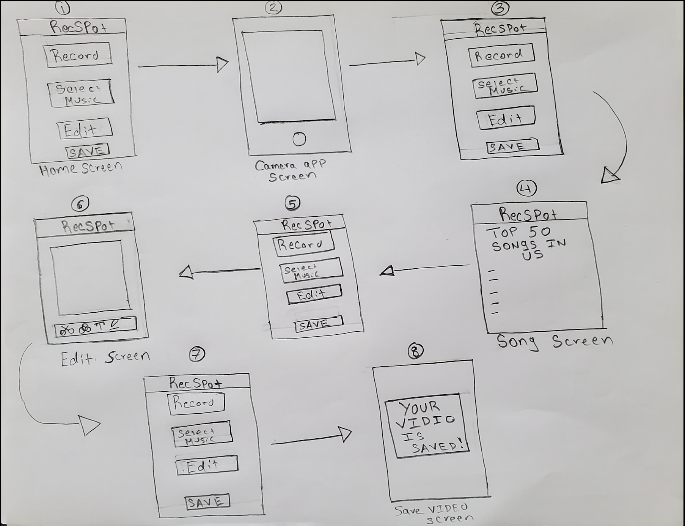
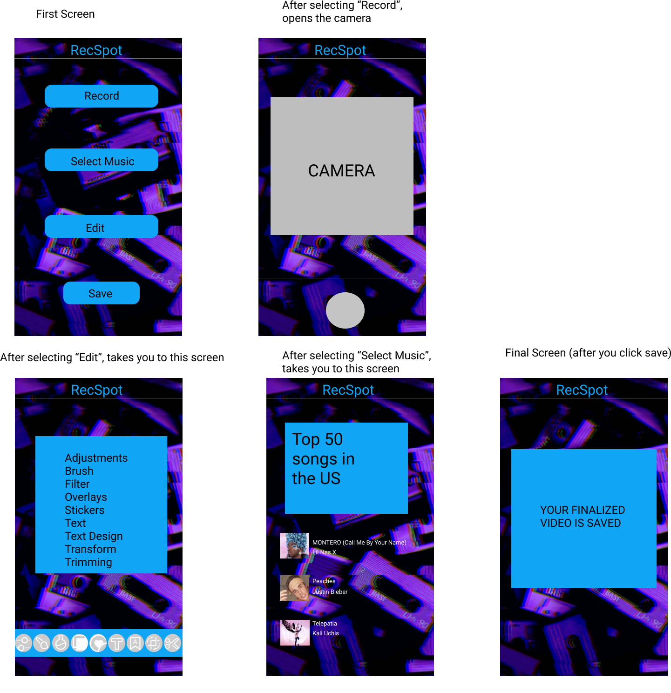

# RecSpot

## Table of Contents
1. [Overview](#Overview)
1. [Product Spec](#Product-Spec)
1. [Wireframes](#Wireframes)
2. [Schema](#Schema)

## Overview
### Description
The purpose of this app is to allow users to record a video that can then be edited with the use of edit options and music taken locally from their phones. To be more precise, the user will be able to record a video and then be given the options: edit the video and add music from their devices. If the user simply wishes not to select these two options, they can just create/save the video they made. 


### App Evaluation
- **Category:** Entertainment/Music
- **Mobile:** This app is specifically designed for mobile devices since it is easier to create/edit videos on with the use of the mobile device's camera. Essentially, the user can create videos from any place they go, whether it being outside in the city with friends to walking your pet dog. Other devices such as the laptop would not be the best option for this specific app due the reason of not everyone taking their laptops everywhere they go, whereas our mobile devices are always with us. 
- **Story:** Allows users to select the music choices they want/the edit options they want. Allows users to to engage in making enojoyable videos with either themselves or with their friends/family. 
- **Market:** There is no age restriction for this app, therefore any individual can use it. 
- **Habit:** If the user thoroughly enjoys making/editing videos, this app can be used everyday. 
- **Scope:** First version of this app will allow the user to simply record a video using the phone's camera and then to edit it. User can edit the video by using the built in edt options. User can then add any music selection from Spotify to the video's background. This can evolve into a social media app where it will allow users to post their edited video and can be able to view other users video where they can like/comment on them. 

## Product Spec

### 1. User Stories (Required and Optional)

**Required Must-have Stories**

- [x] User can view the selected options that are: Record, Select Music, Edit and Save
- [x]  User can select 'Record' so that they can make their video
- [x] User can play and pause the song provided 
- [x] User can play the song selections from their phones 
- [x] User can view 1 of the edit options which is: 
- [ ]  User can view/add the various edit options provided 

### App Walkthrough GIF for Sprint 1
<br>

### App Walkthrough GIF for Sprint 2
<br>

### App Walkthrough GIF Number 1 to show Music Screen for Sprint 3
<br>
**Optional Nice-to-have Stories**

* Sharing on social media platforms such as Instagram, Facebook, etc
* Users can like/comment on the video
* Users can chat with one another 

### 2. Screen Archetypes

* There is essentially no login screen where the user would have to login. Instead, we have the Option Screen - Four options: Record, Select Music, Edit and Save
    * Upon selecting Record, users will be taken to their camera
    * Upon selecting Select Music, users will be taken to the Music Selection screen 
    * Upon selecting Edit, users will be take to the Edit Screen
* Creation (Camera) Screen 
   * Allows users to create their video 
* Music Selection Screen
    * Allows users to select from the top 50 songs currently trending in the US
* Edit Screen
    * Allows users to be able to choose from the various provided edit features 


### 3. Navigation

**Tab Navigation** (Tab to Screen)

* Record Video 
* Save Video 
* Setting

**Flow Navigation** (Screen to Screen)

* Home Screen
   * Record a video
   * Select music 
   * Edit the video recorded
   * Save the video
* Record Screen
   * Home Screen
* Song Selection Screen
    * Home Screen
* Edit Screen
    * Home Screen
* Save Video Screen
    

## Wireframes


### [BONUS] Digital Wireframes & Mockups


### [BONUS] Interactive Prototype
<br>


## Schema 

### Models
#### Video

   | Property      | Type     | Description |
   | ------------- | -------- | ------------|
   |  objectId  | String  |unique id for the user's video (default field) |
   |  vidsCount     | Number |  number of videos the user has created |
   
   #### Edits
  | Property      | Type     | Description |
   | ------------- | -------- | ------------|
   |  objectId| String |after user edits the video it will be saved under a unique Id (default field)|
   | filter | String  | filter feature that the user selects  |
   | adjustments | String | adjustment feature that the user selects |
   | brush| String | brush feature that the user selects|
   | overlays |String | overlays feature that the user selects |
   | stickers | String|stickers feature that the user selects|
   |text| String|text feature that the user selects |
|text design| String|text design feature that the user selects|
|  transform |String |transform feature that the user selects |
|trimming |String |trimming feature that the user selects |

 #### Music
  | Property      | Type     | Description |
   | ------------- | -------- | ------------|
|  objectId| String |songs will have a unique ID  (default field)|
|artist| String|music have specific artist|
|album |String | music have specific album|
|music length| String| each song will have certain time length|
|search music| String| user can search for any music they prefer| 

### Networking
#### List of network requests by screen
- Music Screen
    - (Read/GET) fetching music from Spotify
      ``` swift
        ConnectionParams connectionParams =
        new ConnectionParams.Builder(CLIENT_ID)
            .setRedirectUri(REDIRECT_URI)
            .setJsonMapper(JacksonMapper.create())
            .build();
        SpotifyAppRemote.connect(this, connectionParams, connectionListener);
         ```

#### [OPTIONAL]: Existing API Endpoints
##### An API of Spotify 
- Base URL - https://developer.spotify.com/console/get-audio-features-track/
  HTTP Verb  | Endpoint | Description
   ----------|----------|------------
     `GET`   |https://api.spotify.com/v1/audio-features/{id}| Users can request a song using the Spotify API
  |`GET`|https://api.spotify.com/v1/search |Users can search for music by using the search bar
  
 
##### An API of VideoEditor 

- Base URL - https://img.ly/docs/vesdk/guides/android/v8_1/introduction/getting_started
  HTTP Verb  | Endpoint | Description
   ----------|--------|------------
    `GET`    |https://artifactory.img.ly/artifactory/imgly/| Using this API it will be able to retrieve video-trim, text, brush, filter, sticker, overlay, transform, adjustment, text-design
